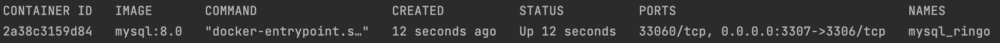
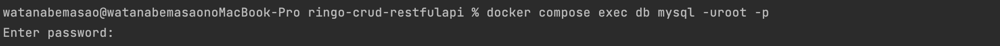
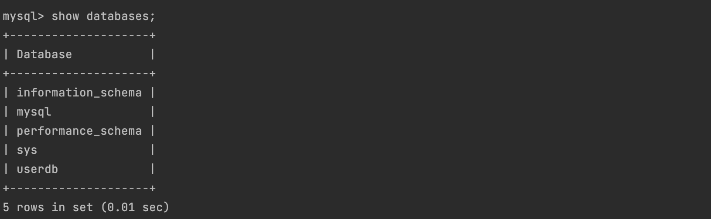
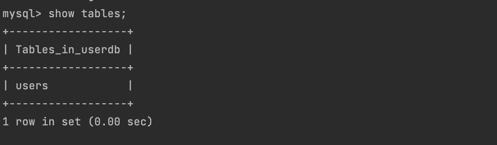
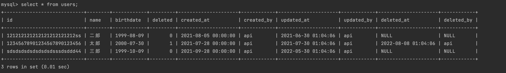
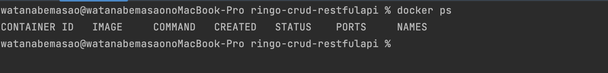

# ringo-crud-restfulapi

# 起動手順
- docker-compose.yamlのあるディレクトリに移動
```
% cd Ringo-RESTfulAPI  
```
- コンテナの作成
```
% docker-compose up -d  
```

# 確認方法
- コンテナの確認
```
% docker ps  
```

- MySQLにログイン。passwordはdocker-compose.ymlに記載(example)
```
% docker compose exec db mysql -uroot -p
```

- DBの確認
```
% show databases;
```

- userdbの使用
```
% use userdb;
```
- テーブルの確認
```
% show tables;
```

- レコードの確認
```
% select * from users;  
```

- ログアウト
```
% exit
```
- 起動したDockerコンテナを停止
```
% docker compose down
```
- 停止の確認
```
% docker ps
```

